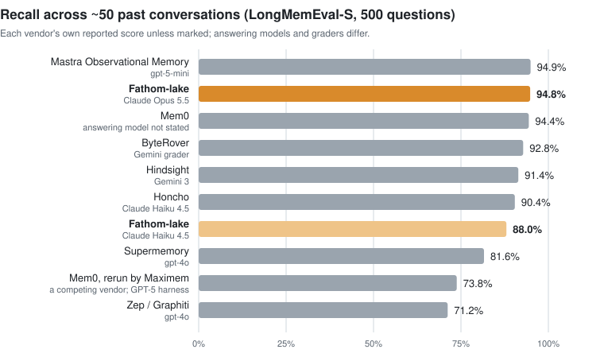
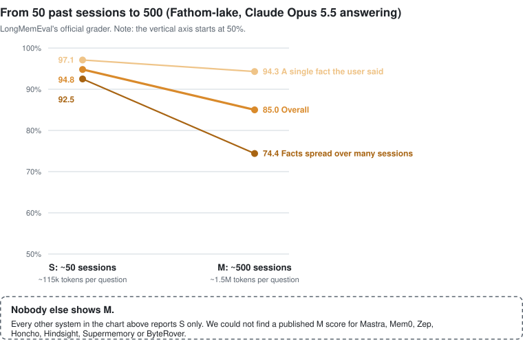

<p align="center">
  <picture>
    <source media="(prefers-color-scheme: dark)" srcset="assets/fathom-logo-dark.svg">
    
  </picture>
</p>

# Fathom-lake

Memory for LLM agents that never throws anything away. Everything your agent hears goes into one SQLite file, exactly
as it was said, and the agent builds its understanding of you (and of itself) on top of that record, citing where
every conclusion came from. You bring the model.

```
pip install fathom-lake
```

## How it scores

[LongMemEval](https://github.com/xiaowu0162/LongMemEval) is the standard test for long-term chat memory: 500
questions, each asked after a long history of past conversations, about things like what the user said three weeks
ago, what changed since, and how many times something happened. Here is where Fathom-lake sits among the memory
systems that publish a score.

<picture>
  <source media="(prefers-color-scheme: dark)" srcset="assets/longmemeval-s-dark.svg">
  
</picture>

Fathom-lake's two scores are graded by the benchmark's own script and grader (`gpt-4o-2024-08-06`, unmodified). The
others are what each vendor reports for itself, with different answering models and graders, so read the chart as a
neighbourhood rather than a ranking. Sources:
[Mastra](https://mastra.ai/research/observational-memory),
[Mem0](https://mem0.ai/blog/state-of-ai-agent-memory-2026) and its
[rerun by Maximem](https://www.maximem.ai/blog/state-of-ai-memory-2026-claimed-vs-observed),
[ByteRover](https://www.byterover.dev/blog/benchmark_ai_agent_memory_real_production_byterover_top_market_accuracy_longmemeval),
[Hindsight](https://arxiv.org/abs/2512.12818), [Honcho](https://honcho.dev/evals),
[Supermemory](https://supermemory.ai/research/longmembench/), [Zep](https://arxiv.org/abs/2501.13956).

### Ten times the history

The test comes in two sizes. **S** gives each question about 50 past sessions (roughly 115,000 tokens). **M** gives
each question about 500 sessions (roughly 1.5 million tokens), which is far more than fits in any prompt, so the
memory has to find the right pieces on its own. Every score in the chart above is an S score: most memory systems
simply don't publish M.

<picture>
  <source media="(prefers-color-scheme: dark)" srcset="assets/longmemeval-s-vs-m-dark.svg">
  
</picture>

Finding one fact in 1.5 million tokens barely moves (97.1% to 94.3%). Gathering facts scattered across many sessions
is the hard part, and it is where we are working next.

### What's most important:

- **We run the M test.** We could not find another published full LongMemEval-M result. Most memory systems run a
  language model over every message as it arrives, to pull out facts, and at 1.5 million tokens per question that
  bill adds up fast. Fathom-lake stores messages as they are, so ingesting M costs nothing but disk.
- **No model call when a memory is saved.** Writing is an insert into SQLite. A model runs later, when you ask it to
  digest (on a timer, overnight, or never), and anything saved while no model was reachable is simply digested later.
- **We say which reader we used.** Swapping Opus for the much smaller Haiku, with the same memory and the same
  retrieved context, costs about seven points. Most of the score comes from what the memory finds and how it lays
  it out.

**How these were measured.** One fresh lake per question, holding every turn of every past session as one row. No
digestion and no summaries, retrieval only. The question goes to `context()` with a 48,000-character budget, using
full-text and vector search together (`nomic-embed-text` embeddings). The answering model sees that context, the
question date, and an instruction to answer from memory and say when it does not know. On S it answered 27 of the
30 trick questions (questions whose premise is false) with "I don't know".

## Nothing is ever deleted

Every row the lake holds is a **delta**: something that happened, with who said it, when, and what it was derived
from. Deltas are never edited and never deleted (unless you gave one an expiry date when you wrote it).

So when a fact changes, the old fact stays, and the correction points at it:

```python
old = mem.write("The drift threshold is 0.35.", source="notes")
mem.write("We changed the drift threshold to 0.15.", source="notes")
mem.engage(old.id, "refute", by="robin", note="We chose 0.15, not 0.35.")
```

Recall still finds the old row, now marked `⟵ refuted ×1 (robin · We chose 0.15, not 0.35.)`, so the agent can say
what it used to believe and why that changed. Digestion notices when a newer row replaces an older one and records a
supersession link instead of overwriting anything.

Everything the lake writes about itself (session summaries, moods, its sense of self) is a delta too, and cites the
rows it was made from. `mem.lineage(id)` walks any conclusion back to the words it rests on, and `mem.cited_by(id)`
walks forward to everything built on a row. Because the raw record is complete, the history can always be rebuilt
from it: `lake export` writes every delta as JSONL, and the derived layer (summaries, moods, the self) can be
regenerated from the rows your hosts wrote, with a newer model, while the old versions stay on record.

## It becomes someone

Given a model, the lake keeps a **crystal**: the agent's own first-person account of what it holds to, where it is
pulled two ways, and what it has not settled, with every item citing the memories behind it. Each new crystal is a
set of cited edits to the last one, so the self changes in explicit, sourced steps, and `lake crystal --log` shows
how it grew. Beside it the lake keeps **stances**, positions whose confidence is read from the evidence for and
against them.

We test this on invented worlds (fictional people, projects and opinions, months of conversation each):

- **Continuity.** Across rebuilds, the crystal kept all but 2 of 64 stable items. Regenerating the self from scratch
  each time lost 16 of 50.
- **Holding a position.** Shown material that looks relevant but does not bear on a stance, the agent held its
  position 6 times out of 6 with its memory, and 3 out of 6 without it.
- **Knowing what is open.** The crystal named 14 of 24 unresolved questions, where the earlier free-prose self named 5.
- **Two lives, two selves.** Twin lakes given different histories split on 2 of 4 contested questions, where the
  free-prose self split on none.

## Use it: as a library, self-hosted, or on a central server

The same file and the same API work in all three setups; only where the file lives changes.

### As a library, inside your own program

```
pip install fathom-lake                # standard library only; add [numpy] for faster vector recall
```

```python
import lake

mem = lake.open("agent.lake")          # one file per agent, reader, or user

mem.write("the rope on the sill is for the window, not the door", source="reader", tags=["book:holes"])
prompt_block = mem.context("what is the rope for")    # recalled memory, rendered as prompt text

# optional: give it a model and it digests (summaries, mood, the crystal), whatever is due
mem = lake.open("agent.lake", think="claude:--model claude-opus-5-5[1m]")
mem.digest()                           # safe to call as often as you like, from your own loop or scheduler
```

The model is any callable `think(prompt, *, system=None, json=False)` or a spec string: `claude` (runs `claude -p`
on your machine), `ollama:<model>@<url>`, or `cmd:<shell command>`. Embeddings are optional; without them recall is
full-text only. [`GUIDE.md`](GUIDE.md) walks through a complete agent, and
[`examples/agent_with_memory.py`](examples/agent_with_memory.py) is the same thing in 30 lines.

### Self-hosted, for Claude Code or Codex on your own machine

The plugin gives your coding agent a lake: every prompt and reply is written, and relevant memory is recalled into
each new prompt. The file lives at `~/.lake/claude.lake` and nothing leaves your machine except the model calls you
already make.

```
pip install 'fathom-lake[mcp]'
git clone https://github.com/myrakrusemark/fathom-lake
cp -r fathom-lake/plugin ~/.claude/skills/lake        # Claude Code loads it on the next start
bash ~/.claude/skills/lake/scripts/install-timer.sh    # nightly digest with `claude -p` (a systemd user timer)
```

Codex uses the same hooks; see [`plugin/codex/README.md`](plugin/codex/README.md). Every setting is optional and
listed in [`plugin/README.md`](plugin/README.md).

### On a central server, one memory for several machines

Put the file on one machine and serve it; every other machine, agent, or program uses it over HTTP with the same API.
The model runs where the file is, so digestion happens on the server.

On the server:

```
pip install fathom-lake
export LAKE_TOKEN=$(openssl rand -hex 24)      # or put it in ~/.lake/token, mode 0600
lake serve --lake ~/.lake/team.lake --bind 0.0.0.0 --port 8377 --think claude --digest nightly
```

On each client, point at it once in `~/.lake/env`, and the CLI, the plugin, and `lake.open()` all use it:

```
LAKE=http://server:8377
LAKE_TOKEN=<the same token>
```

```python
mem = lake.open("http://server:8377", token="...")    # or lake.open() to read ~/.lake/env
```

A server refuses to listen beyond localhost without a token. Writes made while the server is unreachable wait in a
local spool (`~/.lake/spool.jsonl`) and are sent on the next call. SPEC §13 has the details.

## Read more

- [`GUIDE.md`](GUIDE.md): building an agent with memory, local or networked.
- [`SPEC.md`](SPEC.md): the complete behaviour, signature by signature.
- [`plugin/README.md`](plugin/README.md): the Claude Code and Codex plugin.

MIT licensed.
